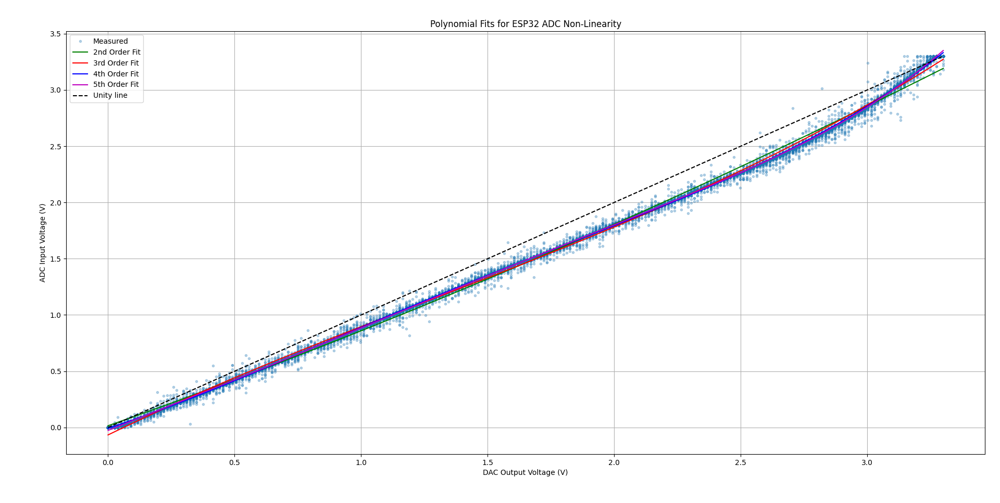
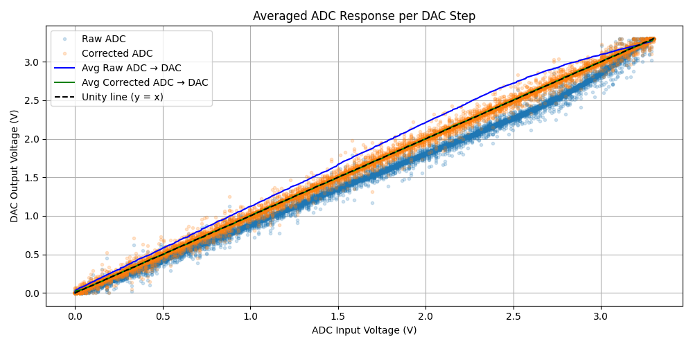

# ESP32 ADC Calibration with DAC and Lookup Table

This project compensates for the non-linearity of the ESP32's built-in ADC using DAC-based calibration. By collecting data from the internal DAC and ADC, we generate a corrected lookup table (`adc_correction_lookup.h`) for use in real-time measurements.

---

## 🧠 Concept

ESP32’s ADC is known to suffer from non-linearity, especially at the lower and upper ends of its 0–3.3V range.

To correct this:
- We use the internal DAC to generate known voltages.
- These voltages are read by the ADC.
- We analyze the non-linear relationship between DAC output and ADC input.
- A **lookup table (LUT)** is created to map raw 12-bit ADC values to corrected ones.

---

## 🧠 How the Calibration Works (8-bit DAC → 12-bit ADC)

The ESP32’s built-in ADC is non-linear, especially at low and high voltage regions. To correct this, we use the ESP32’s internal **8-bit DAC** to generate known voltages and measure them using the 12-bit ADC.

### 🎯 Goal:
Build a correction map (lookup table) from **raw ADC values** to **corrected linear values**, based on how the DAC voltage was interpreted.

---

### 🔍 Resolution Overview

| Component | Bits | Steps | Voltage Resolution |
|----------|------|-------|---------------------|
| DAC      | 8    | 256   | ~13 mV/step         |
| ADC      | 12   | 4096  | ~0.8 mV/step        |

Since the DAC is lower resolution, we don’t cover every possible ADC value directly — but we can interpolate!

---

### 🧪 Calibration Steps

1. **Sweep DAC values from 0–255**
   - Each step generates a known analog voltage:
     \[
     V_{DAC} = \frac{\text{DAC}}{255} \times 3.3\,\text{V}
     \]

2. **Take 100 ADC samples per DAC value**
   - Gives an average ADC reading for each known DAC voltage

3. **Build a calibration curve**
   - Map: `avg_adc_voltage[]` ⟶ `avg_dac_voltage[]`

---

### 🔁 Interpolation for Full 12-bit Range

Since we only measured 256 points but have 4096 possible ADC values:

- We **interpolate** the measured curve to estimate:
  `ADC_voltage → ideal_DAC_voltage`


- Then convert the corrected DAC voltage back into a **corrected 12-bit ADC value**

This gives us a full-length **lookup table**:
```c
const uint16_t adc_correction_lut[4096];
```
Each entry maps:
```
raw_adc → corrected_adc
```

---

### 🧠 Why It Works

- Multiple ADC samples per DAC step smooth out noise
- Interpolation fills in the gaps between DAC steps
- No need to assume a global polynomial — we let the data speak

---

### ⚡ Real-Time Correction

On the ESP32, use this correction instantly:

```cpp
uint16_t corrected = adc_correction_lut[analogRead(33)];
```

- No floating point math
- Fast and precise
- Tailored to your exact chip

This hybrid approach combines real measurement, averaging, and interpolation to yield a practical, efficient ADC correction pipeline.


## 📦 Project Structure

```
ESP32-ADC-Calibration/
├── Arduino/
│   └── adc_calibration_sender.ino         # Collects ADC and sends over serial
├── Python/
│   ├── collect_adc_data.py                # Collect and save ADC data to .npz
│   ├── analyze_adc_curve.py               # Visualize and analyze calibration
│   ├── generate_lookup_table.py           # Create adc_correction_lookup.h
│   └── data/                              # Automatically created to store .npz
├── output/
│   └── adc_correction_lookup.h            # Generated LUT for ESP32
└── README.md
```

---

## 🚀 Usage Guide

### 1. 🔌 Wiring
- Connect DAC output pin **GPIO25** to ADC input pin **GPIO33**

### 2. 📤 Upload Arduino Sketch
Upload `Arduino/adc_calibration_sender.ino` to your ESP32.

It listens for a serial command `'S'`, then:
- Sweeps DAC from 0–255
- Reads ADC 100 times per step
- Sends: `DAC<TAB>RAW_ADC<TAB>CORRECTED_ADC`

### 3. 💻 Collect Data

In `/Python/collect_adc_data.py`:

```bash
python collect_adc_data.py
```

This script:
- Sends `'S'` to ESP32
- Captures data
- Saves it in `/Python/data/esp32_dac_adc_corrected_YYYYMMDD_HHMMSS.npz`
- Shows a plot of raw vs corrected ADC values

### 4. 📊 Analyze Calibration

```bash
python analyze_adc_curve.py
```

This script:
- Loads the latest `.npz`
- Computes averaged ADC curves
- Shows overlay of raw and corrected performance

### 5. 🧮 Generate Lookup Table

```bash
python generate_lookup_table.py
```

This script:
- Loads the latest `.npz`
- Interpolates inverse mapping
- Outputs `output/adc_correction_lookup.h` with 4096 `uint16_t` entries

---

## 📈 Sample Output

Plots will help you compare:

- Raw ADC vs DAC (scattered and curved)
- Corrected ADC vs DAC (closer to ideal line)
- LUT mapping curve (Raw → Corrected)

---

## 🤔 Why Lookup Table Instead of Polynomial Fit?

While it's possible to fit a curve (e.g., 2nd–5th order polynomial) to correct the ADC non-linearity, this approach introduces several issues:

- Polynomial fitting is prone to overshoot or bias near the extremes (as shown below).
- A single equation cannot always model real-world asymmetry and quantization noise.
- Higher-order polynomials increase computation and risk instability in embedded systems.

Instead, we use a **precomputed lookup table** (LUT) for accurate and efficient correction.



In the image:
- Dots: Raw measured data from DAC → ADC
- Colored lines: Polynomial fits (2nd to 5th order)
- Black dashed line: Ideal linear ADC response

Only the LUT approach directly learns from the actual device response and provides **predictable correction** for every 12-bit raw ADC value.

## 🎯 Result: Corrected vs Raw ADC Response

The lookup table effectively reshapes the ESP32’s raw ADC readings to match the expected linear response of the DAC output.



- 🔵 Blue dots: Raw ADC readings for each DAC step
- 🟠 Orange dots: Corrected ADC values after applying the LUT
- 🔵 Blue line: Averaged raw ADC response
- 🟠 Orange line: Averaged corrected response
- ⚫ Black dashed: Ideal y = x unity line

As shown above, the corrected ADC output tracks the ideal line significantly better than the raw input — especially at the edges where the ESP32's ADC error is highest.


## ✅ Notes

- You can optionally clamp early LUT entries to zero to avoid overcorrection at low ADC values.
- The generated LUT is ready for real-time compensation using:
  ```cpp
  uint16_t corrected = adc_correction_lut[analogRead(33)];
  ```

---

## 🔧 Requirements

Install Python dependencies:

```bash
pip install numpy matplotlib scipy
```

---


